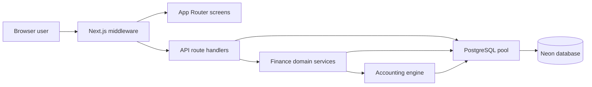

# System architecture

## Purpose and deployment model

The application is a cloud-hosted POS with integrated double-entry accounting. Each business receives a separate application installation and database. There is no tenant ID and no row-level multi-tenancy. Database isolation is the tenant boundary.

Current intended scope:

- One business and one database per deployment.
- Pakistan operation and PKR amounts with two decimal places.
- One administrator for normal operation.
- Browser UI backed by Next.js route handlers and PostgreSQL/Neon.
- No Docker and no Next.js standalone output.

## Technology stack

| Layer | Technology |
|---|---|
| Web application | Next.js 15 App Router |
| UI | React 19, TypeScript, Tailwind CSS |
| Database | PostgreSQL; production target is Neon |
| Database driver | `pg` connection pool |
| Authentication | Database users, scrypt password hashes, signed HTTP-only cookie |
| Charts/reports | Chart.js, Recharts, jsPDF |
| Tests | Node test runner and isolated PGlite PostgreSQL-compatible database |

## Runtime layers

Middleware authenticates requests, enforces coarse role/origin rules and injects trusted actor headers. Route handlers parse HTTP input and run writes through a database transaction. Domain services validate business rules, lock affected records, update documents/inventory and post journals. Database constraints provide a final integrity boundary.

## Source layout

- `src/app/(auth)` — login screen.
- `src/app/(screens)` — dashboard and operational screens.
- `src/app/api` — HTTP route handlers.
- `src/lib/accounting.ts` — money validation, account resolution, journal posting and reversal.
- `src/lib/finance-service.ts` — sales/purchase creation, replacement and void logic.
- `src/lib/invoice-math.ts` — exact invoice totals and proportional discount allocation.
- `src/lib/payments.ts` — receipts, supplier payments and payment reversal.
- `src/lib/allocate-payment.ts` — allocation of existing advances.
- `src/lib/returns.ts` — sale/purchase returns and return reversals.
- `src/lib/finance-http.ts` — transaction wrapper, actor context and error conversion.
- `src/lib/session.ts` and `src/middleware.ts` — session signing and access enforcement.
- `migrations` — ordered PostgreSQL schema history.
- `scripts` — migration runner and administrator creation.
- `tests` — unit, integration, migration and security tests.

## Write transaction pattern

Financial write routes use `financeWrite`:

1. Obtain a pooled database client.
2. Start a transaction.
3. set `app.actor` from the trusted middleware header for audit records.
4. Validate input and lock affected parties/documents/products in stable order.
5. Update the source document and inventory.
6. Create a balanced journal and matching general-ledger rows.
7. Write an audit event.
8. Commit everything together, or roll everything back on any error.

Business validation errors return HTTP 400. Unexpected errors return HTTP 500. The database transaction prevents a document being committed without its inventory/accounting effects.

## Concurrency strategy

- Customer/vendor and document rows are locked with `FOR UPDATE` during financial changes.
- Product rows are sorted by ID before locking to reduce deadlock risk.
- Account rows are held with `FOR SHARE` while posting.
- Payment request keys use a transaction advisory lock to serialize retries.
- Migration execution uses a database advisory lock.
- Bank reconciliation locks selected ledger rows.

## Trust boundaries

The browser is untrusted. Submitted totals, payment status, cost and account IDs are not treated as authoritative. The server recalculates totals and resolves configured accounts. Middleware overwrites user identity headers. PostgreSQL checks balanced journals, valid debit/credit sides, foreign keys and immutable engine-version-2 entries.
