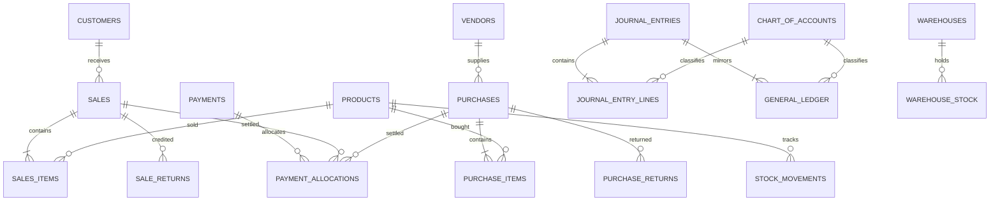

# Database and migrations

## Migration sequence

| File | Responsibility |
|---|---|
| `000_baseline.sql` | Original POS tables, sequences, relationships and legacy posting functions/triggers. |
| `001_account_mappings.sql` | Configurable posting-role to account-code mappings. |
| `002_accounting_core.sql` | Account seeds, settings, payments, stock movements, audit/revisions, journal protections, credit fields and valuation fields. It removes legacy auto-posting triggers. |
| `003_access.sql` | Application users and login-attempt throttling. |
| `004_operations.sql` | Manual-journal proposals, bank reconciliation, warehouses and transfers. |
| `005_payment_requests.sql` | Original payment request payload for strict idempotency comparison. |

The migration runner calculates SHA-256 checksums, records applied files in `schema_migrations`, applies the complete pending batch in one transaction and rejects a changed file that was already recorded. On an existing database it only adopts the baseline when all expected baseline columns are present. `--status` opens a read-only transaction and does not create migration metadata.

## Core business tables

| Area | Tables | Purpose |
|---|---|---|
| Parties | `customers`, `vendors` | Contact records; customers optionally have a credit limit. |
| Catalogue | `products`, `brands`, `categories` | Stock/service catalogue, prices, quantity and inventory value. |
| Sales | `sales`, `sales_items` | Customer invoice header and lines. |
| Purchases | `purchases`, `purchase_items` | Vendor bill header and lines. |
| Returns | `sale_returns`, `sale_return_items`, `purchase_returns`, `purchase_return_items` | Partial/full credit notes and original-cost details. |
| Expenses | `expenses` | Cash operating expenses. |
| Payments | `payments`, `payment_allocations` | Customer receipts, supplier payments, advances and allocations. |
| Inventory | `stock_movements`, `warehouses`, `warehouse_stock`, `warehouse_transfers` | Movement audit and physical warehouse quantities. |

## Accounting and control tables

| Table | Purpose |
|---|---|
| `chart_of_accounts` | Unique account code, name, type, subtype and active state. |
| `accounting_account_mappings` | Maps logical roles such as `receivable` or `cogs` to account codes. |
| `journal_entries` | Posted journal headers, source reference, engine version and reversal link. |
| `journal_entry_lines` | Debit/credit journal lines. |
| `general_ledger` | Reporting ledger mirroring every journal line. |
| `business_settings` | Singleton business/accounting configuration and closed-through date. |
| `audit_events` | Actor, action and before/after JSON data. |
| `document_revisions` | Snapshots taken before a supported invoice replacement. |
| `journal_proposals` | Manual-journal maker/checker workflow. |
| `bank_reconciliations` and `bank_reconciliation_lines` | Cleared ledger rows and statement balance. |
| `app_users`, `login_attempts` | Authentication data and throttling state. |

## Important fields

- `engine_version = 2` marks documents/journals created by the new accounting engine.
- `voided_at` marks a voided document/payment without deleting it.
- `credited_amount` is the total value of completed returns against an invoice.
- `amount_paid` is the amount currently allocated/settled after refunds and reversals.
- Invoice outstanding is `total_amount - credited_amount - amount_paid`.
- `document_kind` distinguishes normal invoices from opening-balance control documents.
- `products.stock` is integer total quantity; `inventory_value` is the exact pooled book value.
- `net_total` stores each line's share after discount and before invoice tax.
- Sale item/return `cost_total` preserves book cost for exact later reversal.
- `payments.request_payload` records the original request used by the idempotency key.

## Relationships

## Database-enforced invariants

For engine-version-2 journals, deferred triggers require at least two lines, exact debit/credit balance and a matching multiset of journal and ledger rows. Each line must have exactly one positive side. Rows cannot be appended after the creating transaction commits. Posted journal headers, lines and ledger rows cannot be updated or deleted; reversal is required.

Foreign keys protect most relationships. Check constraints enforce positive payment/allocation values, valid roles/kinds, nonnegative inventory value, valid item type and one-sided payment party ownership.

## Legacy data policy

Migrations are additive and preserve existing IDs/documents. They do not prove that legacy postings are correctly classified and do not repair old entries. New actions against legacy invoices are intentionally blocked where original cost or accounting cannot be trusted. Corrections must be reviewed and posted as new journals/opening balances rather than rewriting history.
